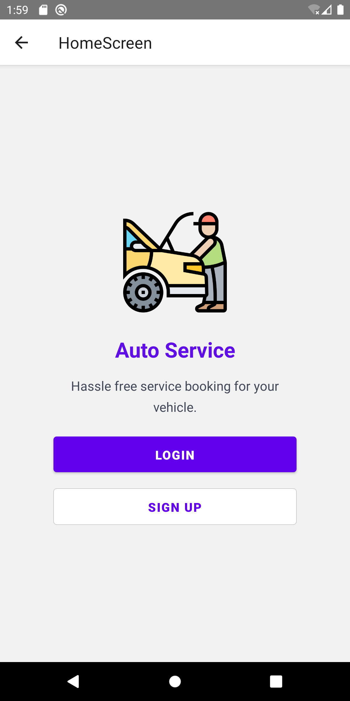
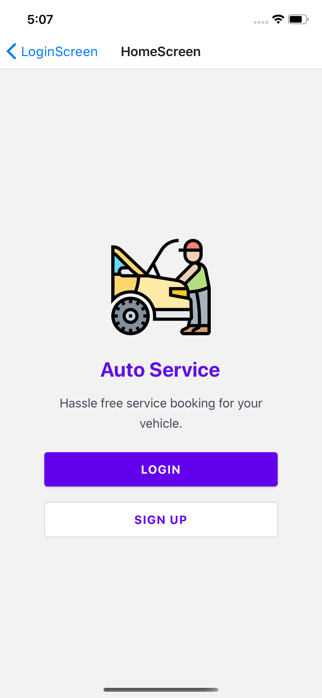
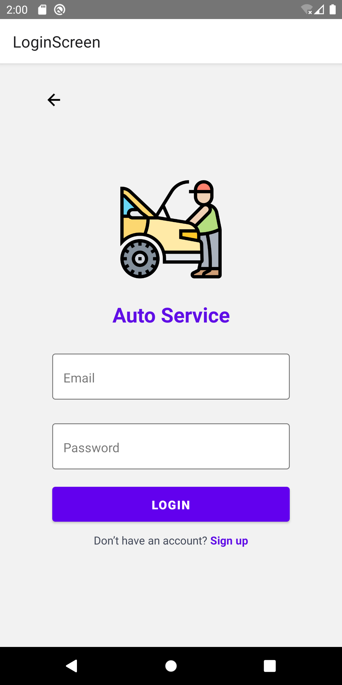
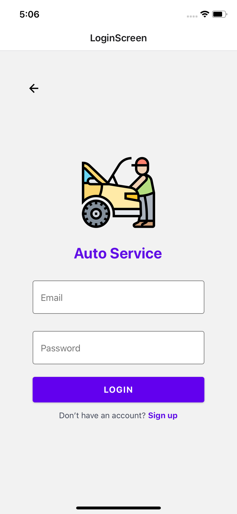
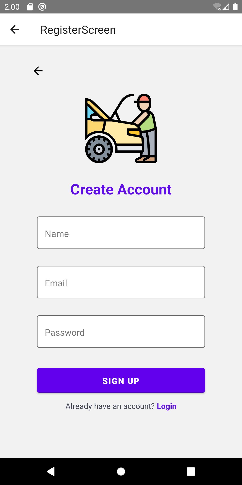
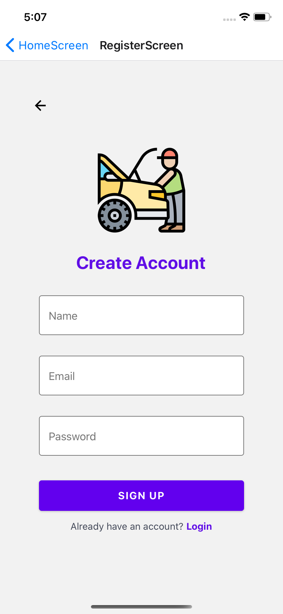
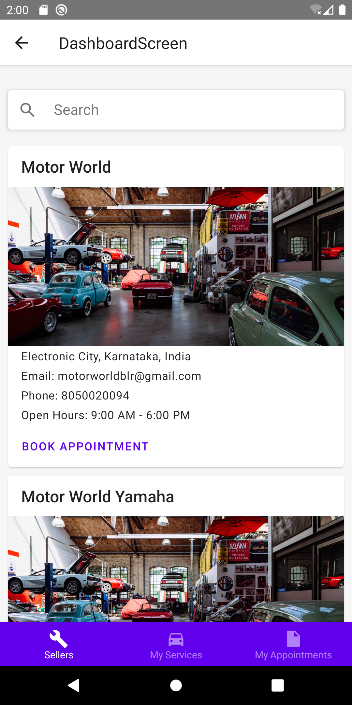
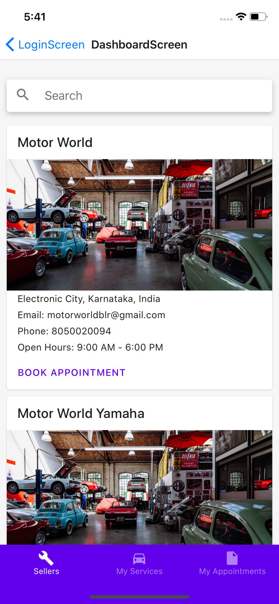

# Auto Service

An application solution for multitenant automobile service providers.

## Software Dependencies

- Node
- MongoDB
- Android SDK / XCode (optional: for running app on simulator)

## What is done

- Auto format code using prettier
- Lint fixes using eslint
- API documentation using apidocjs
- Secure REST API with JWT authentication
- Deployed documentation in GiHub pages
- Deployed API on virtual private server
- Deployed web app on firebase
- Web : seller registration, login, add default slot times, open slot for a date
- App : Signup, login, dashboard, seller list

## What can be improved or added

- Improve user interface - Web, App
- Better directory structure
- Code refactoring for better reusability and maintainability
- Unit testing and code coverage
- Location based seller listing on app (sort nearby) - App
- CI/CD for auto build and deployment
- Forgot password, reset password - Web, App
- OTP authentication - App
- Email confirmation - Web, App
- Payment gateway and billing/invoicing system - Web, App
- Better form controls (only digits on phone number, validations, dynamic dropdowns, etc.) - Web, App
- Improve state management and network calls - Web, App
- Validation on password confirmaion - Web
- Improve logic for securing protected web routes - Web
- Pagination - Web
- Edit/delete items from list - Web
- Comments on code for maintainability - Web, App, API
- Redux/MobX - Web, App
- Improve user experience - Web, App
- Progress spinner - Web, App
- Close an opened slot date - Web
- Close expired slot date - Web
- Avoid callback hells - API
- Move re-usable code to utils
- MongoDB Security

## REST API documentation

https://anshad.github.io/auto-service/

## REST API Endpoint

http://51.161.8.184:3000/api/v1/

## Web Portal

https://assist-8346a.firebaseapp.com/#/login

## Re-publish API documentation

    git subtree push --prefix api/doc origin gh-pages

## App - screens

| Android                                                          |                                  ios                                  |
| ---------------------------------------------------------------- | :-------------------------------------------------------------------: |
|       |       |
|      |      |
|     |     |
|  |  |

## Hack-fix for icon/build issues

The latest version of react native will take care of auto linking dependencies. But we need some hack-fix for icon issues.

To have icons on android, run `react-native link react-native-vector-icons` (need to unlink for running or building ios)

To fix ios build error, run `react-native unlink react-native-vector-icons` then to fix icon issues add the following in `ios/autoService/Info.plist` after `<key>UIAppFonts</key>`.

    <array>
        <string>FontAwesome.ttf</string>
        <string>FontAwesome5_Brands.ttf</string>
        <string>FontAwesome5_Regular.ttf</string>
        <string>FontAwesome5_Solid.ttf</string>
        <string>Foundation.ttf</string>
        <string>Ionicons.ttf</string>
        <string>MaterialIcons.ttf</string>
        <string>MaterialCommunityIcons.ttf</string>
    </array>

## References

- [NodeJS](https://nodejs.org/en/docs/)
- [Express](https://expressjs.com/)
- [MongoDB](https://docs.mongodb.com/)
- [Mongoose](https://mongoosejs.com/)
- [APIDoc](https://apidocjs.com/)
- [EsLint](https://eslint.org/)
- [Prettier](https://prettier.io/)
- [MarkDown](https://www.markdownguide.org/)
- [JWT](https://jwt.io/)
- [Express Validator](https://express-validator.github.io/docs/)
- [React](https://reactjs.org/)
- [React Navigation](https://reactnavigation.org/en/)
- [React Native](https://facebook.github.io/react-native/)
- [React Native Paper](https://callstack.github.io/react-native-paper/index.html)
- [MobX](https://mobx.js.org/README.html)
- [Redux](https://redux.js.org/)
- [BCryptJS](https://www.npmjs.com/package/bcryptjs)
- [Body Parser](https://www.npmjs.com/package/body-parser)
- [Lodash](https://lodash.com/)
- [Nodemon](https://www.npmjs.com/package/nodemon)
- [dotenv](https://github.com/motdotla/dotenv)
- [PM2](https://www.npmjs.com/package/pm2)
- [React Router](https://reacttraining.com/react-router/)
- [ReactStrap](https://reactstrap.github.io/)
